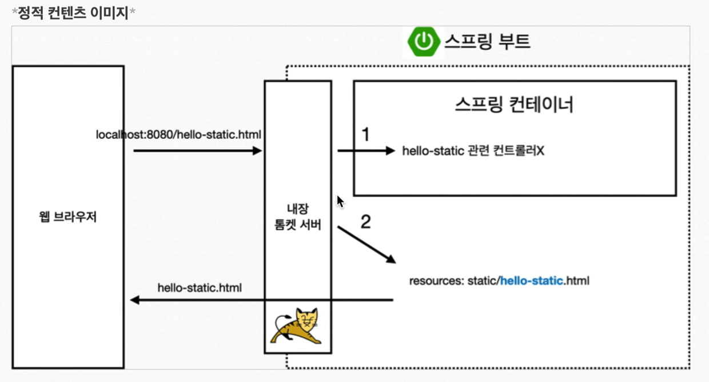
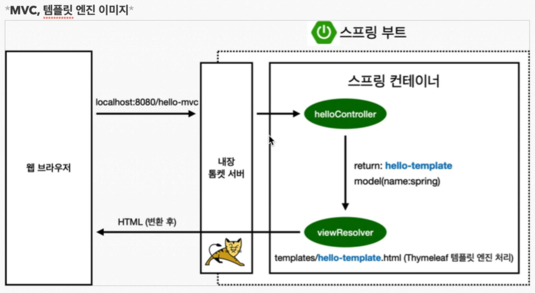
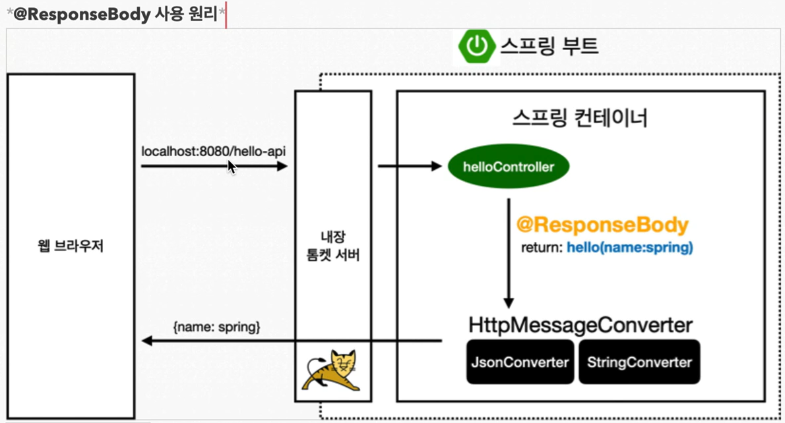

# YoungHan_Spring_Basic

[김영한 스프링 입문](https://www.youtube.com/watch?v=qyGjLVQ0Hog&list=PLumVmq_uRGHgBrimIp2-7MCnoPUskVMnd)

- 스프링부트 기초 개념을 채우기 위한 실습
- 여러번 반복 학습을 하며 개념을 채우자

<br>

---

<br>

#### 4. [View 환경 설정](https://www.youtube.com/watch?v=P6AgXuh-fxA&list=PLumVmq_uRGHgBrimIp2-7MCnoPUskVMnd&index=4)
- devtools 라이브러리를 추가하면 `html`파일을 컴파일만 해줌녀 서버 재시작 없이 View파일 변경 가능

```developmentOnly 'org.springframework.boot:spring-boot-devtools'```

<br>

### < 웹개발 방법 >
- `정적컨텐츠` : html 파일을 바로 전달
- `MVC와 템플릿 엔진` : 서버에서 동적으로 작업을 하여 전달
- `API` : JSON 형식으로 전달한다.
  - 프론트엔드에서 Vue, React을 활용한 개발을 할 때 사용
  - 서버간 데이턴 전달 할 때 사용

<br>

#### 5. [정적컨텐츠](https://www.youtube.com/watch?v=yZVTnaudGXk&list=PLumVmq_uRGHgBrimIp2-7MCnoPUskVMnd&index=6)
  - `static/hello-static` : http://localhost:8080/hello-static.html
  

<br>

#### 6. [MVC와 템플릿 엔진](https://www.youtube.com/watch?v=H8LG-GncT94&list=PLumVmq_uRGHgBrimIp2-7MCnoPUskVMnd&index=7)
- `templates/hello-template` : http://localhost:8080/hello-mvc?name=spring
- `helloController` => `hello-mvc` :
  ```java
      @GetMapping("/hello-mvc")
      public String helloMvc(@RequestParam("name") String name, Model model){
      model.addAttribute("name", name);
      return "hello-template";
      }
  ```
  

<br>

#### 7. [API](https://www.youtube.com/watch?v=ec1jW_jBCmI&list=PLumVmq_uRGHgBrimIp2-7MCnoPUskVMnd&index=8)
1. `@ResponseBody`
   - http에 header와 body부분으로 나누어진다.
   - `@ResponseBody` : http의 body부분에 직접 데이터를 넣어 준다.
     ```java
         @GetMapping("/hello-string")
         @ResponseBody
         public String helloString(@RequestParam("name") String name){
             return "hello " + name;
         }
     ```

<br>

2. `API`
- `helloController` => `hello-api` : 
  - Default값이 JSON 이다.
  - XML형식으로 변경 가능
  - 객체를 반환하면 스프링부트는 [HttpMessageConverter]를 통해 기본값 JSON형태로 변경하여 반환한다.
    ```java
    // 7. API
        @GetMapping("/hello-api")
        @ResponseBody
        public Hello helloApi(@RequestParam("name") String name){
            Hello hello = new Hello();
            hello.setName(name);
            return hello;
        }
  
        static class Hello {
            private String name;
  
            public String getName() {
                return name;
            }
  
            public void setName(String name) {
                this.name = name;
            }
        }
    ```
  


