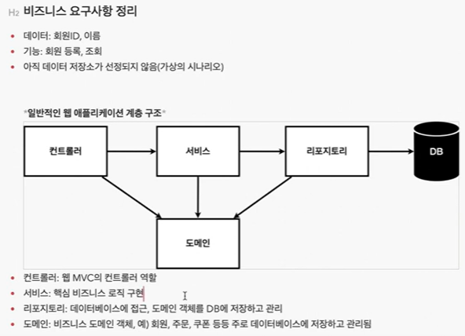
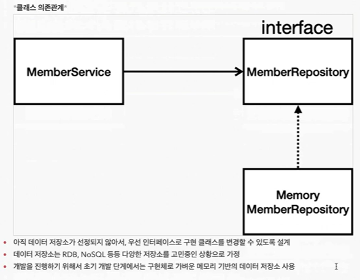
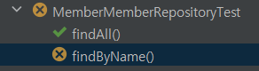

# YoungHan_Spring_Basic

[김영한 스프링 입문](https://www.youtube.com/watch?v=qyGjLVQ0Hog&list=PLumVmq_uRGHgBrimIp2-7MCnoPUskVMnd)

- 스프링부트 기초 개념을 채우기 위한 실습
- 여러번 반복 학습을 하며 개념을 채우자

<br>

---

<br>

#### 4. [View 환경 설정](https://www.youtube.com/watch?v=P6AgXuh-fxA&list=PLumVmq_uRGHgBrimIp2-7MCnoPUskVMnd&index=4)
- `devtools 라이브러리`를 추가하면 `html`파일을 컴파일만 해주면 서버 재시작 없이 View파일 변경 가능

```developmentOnly 'org.springframework.boot:spring-boot-devtools'```


<br>
<br>


### < 웹개발 방법 >
- `<HTML>`
  - `정적컨텐츠` : html 파일을 바로 반환
  - `MVC와 템플릿 엔진` : 서버에서 동적으로 작업을 하여 반환
- `API` : Default => `JSON` 형식으로 전달
  - 프론트엔드에서 Vue, React을 활용한 개발을 할 때 사용
  - 서버 간 데이터 전달 할 때 사용


<br>


#### 5. [정적컨텐츠](https://www.youtube.com/watch?v=yZVTnaudGXk&list=PLumVmq_uRGHgBrimIp2-7MCnoPUskVMnd&index=6)
- `http://localhost:8080/(name).html` 으로 접근
- `static/hello-static` : http://localhost:8080/hello-static.html
- `static/index` : Default Page (서버 접속 시 기본 정적페이지를 보여준다.)
  - Controller 에서 다른 페이지나 ResponseBody값을 넘기면 `static/index`페이지 말고 다른 페이지를 우선적으로 보여준다.

1. 서버 요청을 확인하고 `스프링 컨테이너`에서 관련 요청 확인
2. `스프링 컨테이너` 조회를 후 없으면 관련 `html`을 확인하여 반환


<br>


#### 6. [MVC와 템플릿 엔진](https://www.youtube.com/watch?v=H8LG-GncT94&list=PLumVmq_uRGHgBrimIp2-7MCnoPUskVMnd&index=7)
- `Ctrl + p` : 인자값 즉시 보기
- html : `templates/hello-template`

- `@PattVariable` : Rest Api 에서 값을 호출할 떄 주로 사용
  ```java
      @GetMapping("/hello-mvc/{name}") // http://localhost:8080/hello-mvc/dokim
      public String testMvc(@PathVariable("name")  String name, Model model){
          model.addAttribute("name", name);
          return "hello-template";
      }
  ```

- `@RequestParam` : 파라미터의 값과 이름을 함께 전달
  ```java
      @GetMapping("/hello-mvc2") // http://localhost:8080/hello-mvc2/name=dokim
      public String testMvc2(@RequestParam("name") String name, Model model){
          model.addAttribute("name", name);
          return "hello-template";
      }
  ```

  


<br>


#### 7. [API](https://www.youtube.com/watch?v=ec1jW_jBCmI&list=PLumVmq_uRGHgBrimIp2-7MCnoPUskVMnd&index=8)
`@ResponseBody` : 
   - http에 header와 body부분으로 나누어진다.
   - http의 body부분에 직접 데이터를 넣어 준다.

<br>

1. `String 반환`
- `@RequestParam` 에서 `required = false`설정을 통해 파라미터 데이터가 없어도 작동 할 수 있다.
     ```java
    // 7.1 Retrun String(Not View)
    @GetMapping("/hello-string") // http://localhost:8080/hello-string
    @ResponseBody
    public String helloString(@RequestParam("name") String name){
        return "hello " + name;
    }

    @GetMapping("/hello-string2") // http://localhost:8080/hello-string2 ,  http://localhost:8080/hello-string2?name=dokim
    @ResponseBody
    public String helloString2(@RequestParam(value = "name",required = false) String name){
        return "hello " + name;
    }
     ```

   <br>

2. `API 반환`
- `helloController` => `hello-api` : 
  - Default값이 JSON 이다.
  - XML형식으로 변경 가능
  - 객체를 반환하면 스프링부트는 [HttpMessageConverter]를 통해 기본값 JSON형태로 변경하여 반환한다.
   
- `@RequestBody` : JSON 형식의 요청 => 자바 객체로 변환
- `@ResponseBody` : 자바 객체 => JSON 이나 XML 형식의 문자열로 변환
- [@RequestBody, @ResponseBody 참고 자료](https://ocblog.tistory.com/49)
```java
    // 7.2 API
    @GetMapping("/hello-api") // http://localhost:8080/hello-api?name=dokim&num=010
    @ResponseBody
    public Hello helloApi(@RequestParam("name") String name, @RequestParam("num") int num){
        Hello hello = new Hello();
        hello.setName(name);
        hello.setNum(num);
        return hello;
    }

    static class Hello {
        private String name;

        private int num;

        public int getNum() {
            return num;
        }

        public void setNum(int num) {
            this.num = num;
        }

        public String getName() {

            return name;
        }

        public void setName(String name) {

            this.name = name;
        }
    }
```
  


<br>


#### 8. [비지니스 요구사항 정리](https://www.youtube.com/watch?v=0_oeeYDLSjM&list=PLumVmq_uRGHgBrimIp2-7MCnoPUskVMnd&index=9) 





<br>


#### 9. [회원도메인과리포지토리만들기](https://www.youtube.com/watch?v=Gul8sv7cf8g&list=PLumVmq_uRGHgBrimIp2-7MCnoPUskVMnd&index=10) 

- Repository 디렉토리 확인
  - [Optional 사용법 블로그](https://mangkyu.tistory.com/70)
  - [Optional 사용법 유튜브](https://www.youtube.com/watch?v=W_kPjiTF9RI)
  - [람다식 유뷰트](https://www.youtube.com/watch?v=3wnmgM4qK30&t=975s)
  - [stream, filter 유튜브](https://www.youtube.com/watch?v=7Kyf4mMjbTQ&list=PLW2UjW795-f6xWA2_MUhEVgPauhGl3xIp&index=163)


<br>


#### 10. [회원도메인과 리포지토리 테스트](https://www.youtube.com/watch?v=OmcCT0bU4Kk&list=PLumVmq_uRGHgBrimIp2-7MCnoPUskVMnd&index=11)

- 테스트 순서는 보장되지 않는다. 
- 각각 테스트들은 의존성 없이 설계가 되어야 한다.
- 테스트 객체(메소드)를 실행하고 끝나면 공용 데이터를 지워야 한다.
```java
    @Test
    void findByName() {
        Member member1 = new Member();
        member1.setName("spring1");
        repository.save(member1);

        Member member2 = new Member();
        member2.setName("spring2");
        repository.save(member2);

        Member result = repository.findByName("spring1").get();

        org.assertj.core.api.Assertions.assertThat(member1).isEqualTo(result);
    }

    @Test
    void findAll() {
        Member member1 = new Member();
        member1.setName("spring1");
        repository.save(member1);

        Member member2 = new Member();
        member2.setName("spring2");
        repository.save(member2);

        List<Member> result = repository.findAll();

        org.assertj.core.api.Assertions.assertThat(result.size()).isEqualTo(2);
    }
```

- 위의 코드는 위의 사진처럼 에러를 발생시킨다.
- 테스트 순서는 보장하지 않지만 `findAll()` 이 먼저 테스트하고 데이터가 있는 상태에서 
`findByName`을 실행하면 똑같은 Member 이름을 갖는 객체를 생성하게 된다.

<br>

<해결 방법>
- `@AfterEach` : 테스트 객체들이 끝날 때 마다 실행한다.
  ```java
    public void clearStore(){
        store.clear();
    }
  ```
  - 데이터를 삭제하는 메소드 작성
  - 테스터 객체에서 테스트 메소들을 확인하며 `@AfterEach`로 데이터를 정리하게 한다.


<br>


#### 11. [회원서비스 개발](https://www.youtube.com/watch?v=Ep-CIHRghFw&list=PLumVmq_uRGHgBrimIp2-7MCnoPUskVMnd&index=12)

- 비지니스 로직을 구현
- `회원가입` => `Ctrl + Shift + Alt + T` : 메소드 추출
- `전체 회원 조회`
- `일반 회원 조회`


<br>


#### 12. [회원서비스 테스트](https://www.youtube.com/watch?v=NffW47IBg4I&list=PLumVmq_uRGHgBrimIp2-7MCnoPUskVMnd&index=13)

- `Ctrl + Shift + T` : 테스트 만들기


